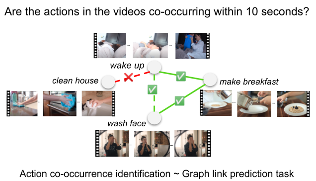

Human Action Co-occurrence in Lifestyle Vlogs using Graph Link Prediction
=================================================================================
Oana Ignat, Santiago Castro, Weiji Li and Rada Mihalcea

Language and Information Technologies (LIT), University of Michigan

This repository contains the dataset and code for our TODO_conference paper:

[Human Action Co-occurrence in Lifestyle Vlogs with Graph Link Prediction](TODO_Link)

## Task Description



Human action co-occurrence in lifestyle vlogs: two actions co-occur if they occur in the same
interval of time (10 seconds) in a video. The actions are represented as nodes in a graph, 
the co-occurrence relation between two actions is represented through a link between the actions, 
and the action co-occurrence identification task as a link prediction task.

## Introduction


## Annotation Details


## Data Format

+ [`dev.json`](data/test.json) 

```js
{
   TODO
}

```

## Setup
```bash
conda env create
conda activate action_order
pip install -r requirements.txt

spacy download en_core_web_sm
spacy download en_core_web_trf
```

## Experiments
+ Run data collection and processing from [`data_processing.py`](data_processing.py) 
+ Run action co-occurrence/ link prediction models from [`link_prediction.py`](link_prediction.py)
+ Run downstream task experiments from [`action_downstream.py`](action_downstream.py)
+ Run data analyses from [`data_analysis.ipynb`](data_analysis.ipynb)
+ Run video related scripts from [`data/utils`](data/utils)


## Citation information
If you use this dataset or any ideas based on the associated research article, please cite the following:

```bibtex
@misc{TODO,
      title={Human Action Co-occurrence in Lifestyle Vlogs with Graph Link Prediction}, 
      author={Oana Ignat and Weiji Li and Santiago Castro and Rada Mihalcea},
      year={2022},
      eprint={TODO},
      archivePrefix={arXiv},
      primaryClass={cs.CV}
}
```
